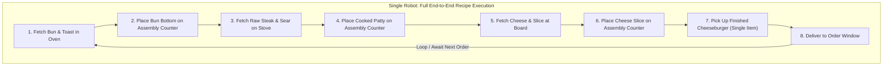

# Food Assembly Counter & Robot Automation System

This document specifies the design, mechanics, technical architecture, and collision rules for the **Assembly Counter** appliance and the **Player Recording & Autonomous Worker Robot System**, where **each robot independently completes an entire recipe from raw ingredients to final delivery**.

---

## 1. Overview & Core Gameplay Loop

### 1.1 The 1-Item Constraint Solution
The player (and each worker robot) can only hold **one item at a time** in their hands (`PlayerController.held_item`). To prepare multi-ingredient composite dishes (e.g., Cheeseburgers, Veggie Burgers, Steak Dinners, Stews), the **Assembly Counter** serves as the physical workstation that accumulates ingredients into a finished dish.



### 1.2 Scaling Throughput with Multiple Independent Bots
* **1 Robot = 1 Complete Recipe Routine:** Each bot owns the complete lifecycle of its assigned recipe order.
* **No Inter-Robot Traffic Deadlocks:** Because **robots can pass through each other**, 5 or 10 robots can simultaneously navigate between crates, appliances, assembly counters, and the order window without blocking or colliding with one another.
* **Player Obstacle:** The player **cannot** pass through robots, meaning the player must navigate around their active robotic workforce.

---

## 2. Assembly Counter Appliance

### 2.1 Store & Placement Specification
* **Item ID:** `AssemblyCounter`
* **Scene Path:** `res://assets/appliances/assembly_counter.tscn`
* **Base 3D Asset:** `assets/kitchen-pack/kitchencounter_straight_A.gltf` (equipped with prep plate / board marker)
* **Store Cost:** $50.00
* **Placement Grid Footprint:** `1.0 x 1.0` (standard 0.5m grid alignment in `PlacementManager`)
* **Collision Layer:** Layer 1 (`Environment`)

### 2.2 Counter State Machine

| Entity State | Counter State | Allowed Action | Result Prompt |
| :--- | :--- | :--- | :--- |
| **Holding Valid Next Ingredient** | Empty or In-Progress | Tap / Short Hold | `"ADD [INGREDIENT]"` $\to$ Item docked to counter, hands cleared. |
| **Holding Invalid Ingredient** | In-Progress | Blocked | `"CANNOT COMBINE"` |
| **Holding Any Item** | Completed Dish | Blocked | `"HANDS FULL"` |
| **Empty Hands** | Completed Dish | Tap Interact | `"TAKE [COMPLETED DISH]"` $\to$ Picked up as single `KitchenItem`. |
| **Empty Hands** | In-Progress | Hold Interact (1.0s) | `"CLEAR / RETRIEVE LAST"` $\to$ Returns top item (avoids stuck states). |
| **Empty Hands** | Empty Counter | None | `""` |

### 2.3 Visual Stacking on Counter
The counter contains an `AssemblyPlate` Marker3D. As ingredients are placed, sub-meshes stack upward:
1. `food_ingredient_bun_bottom.gltf` (Y: +0.00)
2. `food_ingredient_burger_cooked.gltf` (Y: +0.04)
3. `food_ingredient_cheese_slice.gltf` (Y: +0.07)
4. `food_ingredient_bun_top.gltf` (Y: +0.10)
5. On completion, sub-meshes collapse into the single completed dish model (`food_burger.gltf`).

---

## 3. Data-Driven Recipe System

### 3.1 Recipe Resource Schema (`res://scripts/recipe.gd`)
```gdscript
class_name Recipe
extends Resource

@export var recipe_id: StringName
@export var display_name: String
@export var output_item: KitchenItem
## Sequential ingredients required to complete the recipe
@export var ingredient_sequence: Array[KitchenItem] = []
## Optional final assembly duration (0.0 = instant on last ingredient)
@export var assembly_duration: float = 0.0
```

### 3.2 Composite Dish Catalog (Matching `items_and_cooking_recipes.md`)

| Recipe | Sequential Inputs | Output Item | Output 3D Mesh |
| :--- | :--- | :--- | :--- |
| **Classic Cheeseburger** | 1. `bun_bottom`<br>2. `burger_cooked`<br>3. `cheese_slice`<br>4. `bun_top` | `cheeseburger` | `food_burger.gltf` |
| **Garden Veggie Burger** | 1. `bun_bottom`<br>2. `vegetableburger_cooked`<br>3. `lettuce_slice`<br>4. `tomato_slice`<br>5. `bun_top` | `veggie_burger` | `food_vegetableburger.gltf` |
| **Plated Steak Dinner** | 1. `potato_mashed`<br>2. `steak_pieces` | `steak_dinner` | `food_dinner.gltf` |
| **Beef & Carrot Stew** | 1. `steak_pieces`<br>2. `carrot_chopped` (in Pot) | `beef_stew` | `food_stew.gltf` |

---

## 4. Robot Physics & Collision Matrix

### 4.1 Collision Rules
1. **Robots pass through other robots:** Robots do not collide with each other to prevent deadlocks in high-density automation.
2. **Player CANNOT pass through robots:** Robots are physical obstacles for the player.
3. **Robots CANNOT pass through the player or kitchen architecture:** Robots collide with the player, counters, crates, walls, and appliances.

### 4.2 Godot 3D Layer & Mask Setup

| Layer # | Layer Name | Description |
| :---: | :--- | :--- |
| **1** | `Environment` | Kitchen walls, floor, placed appliances, crates, counters |
| **2** | `Player` | Player CharacterBody3D capsule |
| **3** | `WorkerRobots` | Automation worker robots CharacterBody3D |
| **4** | `Interactions` | InteractionArea triggers |

```mermaid
graph TD
	subgraph Collision_Interactions ["Collision Rules Matrix"]
		P[Player - Layer 2] <==> |Solid Collision| E[Environment - Layer 1]
		R1[Robot A - Layer 3] <==> |Solid Collision| E
		R2[Robot B - Layer 3] <==> |Solid Collision| E
		P <==> |Solid Collision| R1
		P <==> |Solid Collision| R2
		R1 -.-> |Passes Through (Layer 3 Excluded from Mask)| R2
	end
```

#### Node Collision Settings:
* **Player (`CharacterBody3D`):**
  * `collision_layer` = `2` (`Player`)
  * `collision_mask` = `1 | 3` (`Environment` + `WorkerRobots`) $\implies$ Player is stopped by walls and worker robots.
* **Worker Robot (`CharacterBody3D`):**
  * `collision_layer` = `3` (`WorkerRobots`)
  * `collision_mask` = `1 | 2` (`Environment` + `Player`) $\implies$ **Robots ignore Layer 3 (other robots)**, allowing full pass-through, while stopping against the player and environment.

---

## 5. Player Action Recording & Full-Recipe Playback

### 5.1 Semantic Action Recording
Instead of recording raw physics ticks (which desync when nudged or navigating tight spaces), the recorder captures **Semantic Waypoints & Interaction Actions**:

```json
[
  { "type": "NAVIGATE_TO", "position": [2.5, 0.0, -1.0] },
  { "type": "INTERACT_TARGET", "target_path": "Architecture/BunCrate", "hold_time": 0.0 },
  { "type": "NAVIGATE_TO", "position": [0.0, 0.0, -3.5] },
  { "type": "INTERACT_TARGET", "target_path": "Architecture/Oven", "hold_time": 2.0 },
  { "type": "NAVIGATE_TO", "position": [-1.5, 0.0, -1.0] },
  { "type": "INTERACT_TARGET", "target_path": "Architecture/AssemblyCounter", "hold_time": 0.0 },
  { "type": "NAVIGATE_TO", "position": [3.0, 0.0, -2.0] },
  { "type": "INTERACT_TARGET", "target_path": "Architecture/SteakCrate", "hold_time": 0.0 },
  { "type": "NAVIGATE_TO", "position": [1.0, 0.0, -3.5] },
  { "type": "INTERACT_TARGET", "target_path": "Architecture/Stove", "hold_time": 2.5 },
  { "type": "NAVIGATE_TO", "position": [-1.5, 0.0, -1.0] },
  { "type": "INTERACT_TARGET", "target_path": "Architecture/AssemblyCounter", "hold_time": 0.0 },
  { "type": "NAVIGATE_TO", "position": [-1.5, 0.0, -1.0] },
  { "type": "INTERACT_TARGET", "target_path": "Architecture/AssemblyCounter", "hold_time": 0.0 },
  { "type": "NAVIGATE_TO", "position": [0.0, 0.0, 1.5] },
  { "type": "INTERACT_TARGET", "target_path": "Architecture/OrderWindow", "hold_time": 0.0 }
]
```

### 5.2 Robot Execution Runtime
1. **Pathfinding:** The worker robot uses `NavigationAgent3D` against the kitchen NavMesh to move between waypoints.
2. **Interaction Area Contract:** When reaching a station, the robot calls `target_area.interact(robot_instance)` just like the player.
3. **Wait & Guard Conditions:** If an appliance or assembly counter is temporarily in use by the player or another process, the robot waits at the station until the required state is ready, preventing broken loops.
4. **Endless Loop / Dispatch:** Upon completing step $N$ (delivering to the order window), the robot immediately returns to step 0 and repeats the full recipe.

---

## 6. Player Experience & Fleet Scaling

1. **Teach by Doing:** The player enters "Record Routine" mode, selects a recipe (e.g. Cheeseburger), and plays through the exact workflow once.
2. **Assign to Bot:** The recorded macro is saved as `Cheeseburger_Routine.tres`.
3. **Spin Up Fleet:** The player purchases 1, 2, 5, or 10 worker bots from the store and assigns each to a routine (e.g., 3 Cheeseburger Bots, 2 Salad Bots, 1 Steak Dinner Bot).
4. **Autonomous Kitchen:** The bots run their full recipes continuously, streaming completed orders to the window while phasing through each other smoothly. The player acts as the kitchen supervisor, managing store upgrades, new recipe recordings, and kitchen layouts.

---

## 7. Implementation Roadmap

1. **Phase 1: Assembly Counter & Recipes**
   - Create `AssemblyCounter` (`InteractionArea`) with visual sub-mesh stacking.
   - Implement `Recipe` resource and define Burger / Steak Dinner recipes.
2. **Phase 2: Collision Setup**
   - Configure Godot Project Physics Layers (`Environment`, `Player`, `WorkerRobots`, `Interactions`).
   - Configure Player and Robot body layer/mask bitmasks.
3. **Phase 3: Action Recorder**
   - Record player waypoints and interaction events to a `RoutineResource`.
4. **Phase 4: Autonomous Worker Robot Agent**
   - Build `WorkerRobot` CharacterBody3D with `NavigationAgent3D`.
   - Implement step-by-step routine executor with state checks and delivery loop.
